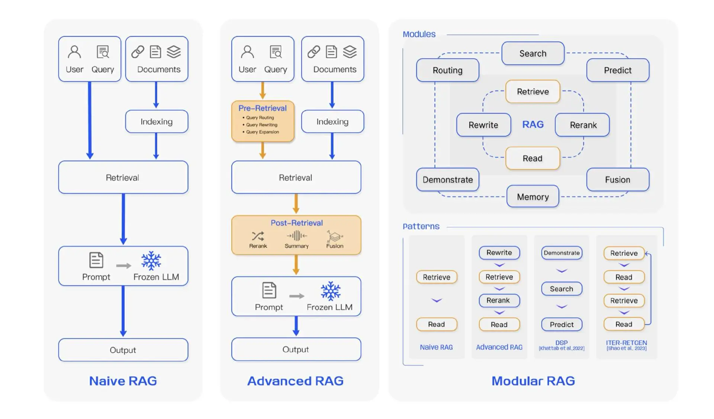
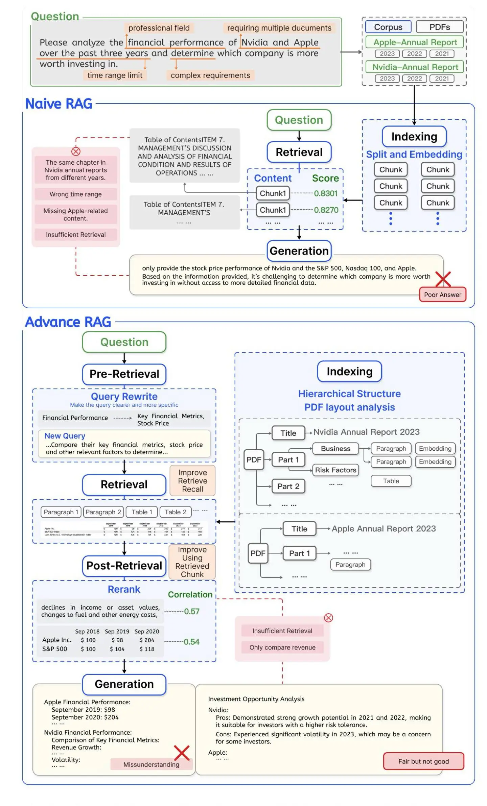

RAG 技术在适应复杂应用场景和不断发展的技术需求中，经历了从最初的 Naive RAG （朴素 RAG），到流程优化的 Advanced RAG，再到更具灵活性的 Modular RAG 的演变。值得注意的是，这三个范式之间具有继承与发展的关系：Advanced RAG 是 Modular RAG 的一种特例形式，而 Naive RAG 则是 Advanced RAG 的基础特例。通过这种逐步演进，RAG 技术不断优化，以应对更复杂的任务和场景需求，如下图所示。

Advanced RAG 通过引入多种技术，采用了检索前、检索中、检索后的优化策略，显著提高了检索质量。下面我们按照检索前、检索、检索后策略分类，系统性地展现当前主流的优化技术方案

# Advanced RAG Optimization Strategies

## 1. 检索前策略

### 1.1 文档分割 (Document Splitting)
- **目的**: 将长文档分割成更小的chunk,以提高检索精度。
- **方法**:
  - 固定长度分割
  - 基于语义的分割 (如段落、章节)
  - 递归分割

### 1.2 文档扩充 (Document Expansion)
- **目的**: 丰富文档内容,增加检索匹配的可能性。
- **方法**:
  - 使用LLM生成文档摘要或关键词
  - 添加元数据 (如标题、作者、日期等)

### 1.3 查询生成 (Query Generation)
- **目的**: 生成多样化的查询表达,提高检索召回率。
- **方法**:
  - 使用LLM生成同义查询
  - 查询分解 (将复杂查询分解为多个简单查询)

## 2. 检索中策略

### 2.1 混合检索 (Hybrid Search)
- **目的**: 结合多种检索方法,平衡精确度和召回率。
- **方法**:
  - 关键词检索 + 语义检索
  - BM25 + 向量检索

### 2.2 多步检索 (Multi-step Retrieval)
- **目的**: 通过多轮检索逐步缩小范围,提高最终结果的相关性。
- **方法**:
  - Coarse-to-fine检索
  - 迭代检索

### 2.3 知识图谱增强检索 (Knowledge Graph Enhanced Retrieval)
- **目的**: 利用结构化知识提高检索的语义理解能力。
- **方法**:
  - 实体链接
  - 关系推理

## 3. 检索后策略

### 3.1 重排序 (Reranking)
- **目的**: 对初步检索结果进行精细化排序,提高Top K结果的相关性。
- **方法**:
  - 基于BERT的重排序模型
  - Learning to Rank (LTR)

### 3.2 结果融合 (Result Fusion)
- **目的**: 综合多种检索结果,提高最终输出的质量。
- **方法**:
  - 投票机制
  - 加权融合

### 3.3 上下文增强 (Context Augmentation)
- **目的**: 为检索结果添加额外上下文,帮助LLM更好地理解和利用信息。
- **方法**:
  - 添加相邻段落
  - 引入外部知识

### 3.4 动态提示工程 (Dynamic Prompt Engineering)
- **目的**: 根据检索结果动态调整提示,提高生成质量。
- **方法**:
  - 基于检索结果的提示模板
  - 自适应提示生成
Advanced RAG 通过在检索前、检索中、以及检索后对 RAG 系统进行优化，显著提升了检索的精准性和生成内容的上下文相关性。
  - 具体优化措施包括且不限于滑动窗口方法、元数据添加、分层索引、句子窗口检索、查询重写、查询扩展、长短不一的内容向量化、动态嵌入、领域特定嵌入微调、假设文档嵌入、混合检索、小到大检索、递归块合并、重排序、提示压缩、上下文重构、内容过滤、多跳推理、知识注入等，使得 RAG 在复杂任务中的表现效果更加优越。
  - Modular RAG 进一步增强了 RAG 系统的灵活性和适应性，允许通过不同模块的自由组合来应对多样化的应用场景。与 Advanced RAG 相比，Modular RAG 最大的不同之处在于其引入了编排机制，包括路由、调度和知识引导等模块，实现了更加智能的流程控制和动态决策。

## 参考

- [1] [使用小块检索，小块所属的大块喂给LLM](https://mp.weixin.qq.com/s/OjPaCW8Z-kXh6KU2CmI42A)
- [2] [使用小块检索](https://mp.weixin.qq.com/s/MzdKPYNYcwna06Evyl4_Mg)
- [3] [QAnything](https://github.com/netease-youdao/QAnything)
