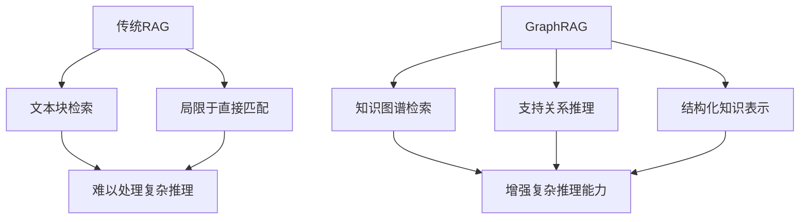
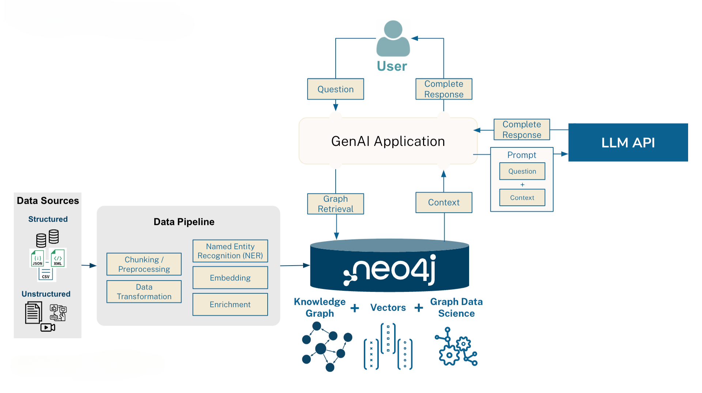

# GraphRAG：增强知识检索与推理能力

## 1. 什么是GraphRAG？

GraphRAG是对传统检索增强生成（RAG）的一种改进，它通过引入知识图谱（Knowledge Graph）来增强检索和推理能力。在GraphRAG中，信息不仅仅以文本块的形式存储，还被组织成一个结构化的图，其中节点代表实体，边代表实体间的关系。

## 2. 为什么使用GraphRAG？

### 2.1 克服复杂推理局限性

- **结构化知识表示**：GraphRAG通过知识图谱将实体和关系明确地表示出来，使得系统能够更容易地进行复杂的推理任务。
- **关系推理**：传统RAG难以处理需要多跳推理的问题，而GraphRAG可以沿着图中的边进行多步推理。

### 2.2 提高检索准确性

- **上下文感知检索**：GraphRAG可以考虑实体间的关系，提供更加相关和上下文相关的检索结果。
- **消除歧义**：通过图结构，可以更好地区分同名不同义的实体。

### 2.3 增强知识整合

- **知识融合**：可以轻松地将来自不同源的知识整合到同一个图结构中。
- **动态更新**：知识图谱可以持续更新和扩展，使系统的知识库保持最新状态。

## 3. GraphRAG如何工作？

1. **知识图谱构建**：
   - 从文本中提取实体和关系
   - 将提取的信息组织成图结构

2. **查询处理**：
   - 将用户查询映射到图中的实体和关系
   - 使用图遍历算法找到相关的子图

3. **上下文生成**：
   - 基于检索到的子图生成结构化的上下文
   - 可能包括实体描述、关系说明等

4. **增强生成**：
   - 将结构化上下文与原始查询一起输入到语言模型
   - 生成考虑了图结构信息的回答

## 4. GraphRAG vs 传统RAG

## 5. 使用GraphRAG的注意事项

- **图构建复杂性**：需要高质量的实体和关系提取
- **计算开销**：图遍历可能比简单的文本匹配更耗时
- **维护成本**：知识图谱需要定期更新和维护

主要特点和改进：

完整的类实现：

所有功能封装在 GraphRAGPipeline 类中
清晰的初始化和配置管理
模块化的方法设计

用户交互：

友好的命令行界面
支持多行文档输入
清晰的进度提示

错误处理：

API 密钥验证
JSON 解析错误处理
用户输入验证

使用示例：

## 6. 结论

GraphRAG通过引入知识图谱，显著增强了传统RAG的推理能力和知识表示能力。它特别适合处理需要复杂推理、多步关系理解的任务，为下一代智能问答和知识管理系统提供了强大的基础。