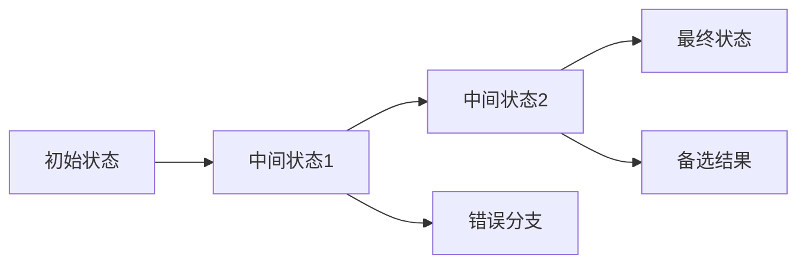

任务流程建模是流程自动化的关键技术之一。在 FSM 系统中，任务流程被建模为多个状态的转换，这些状态之间的转换通常需要复杂的条件判断和搜索算法的支持。LLaMA 3 凭借其强大的自然语言处理（NLP）能力，能够为这些任务流程提供智能化的支持。


各种大模型都能支持 FSM (有限状态机)任务流程建模,我来详细分析一下:

1. 主流模型对FSM的支持:

```python
# 不同模型的FSM处理能力
Models = {
    "LLaMA 3": {
        "NLP能力": "很强",
        "上下文长度": "32k-128k",
        "推理速度": "快",
        "FSM支持": "原生支持"
    },
    "Qwen": {
        "NLP能力": "强",
        "上下文长度": "8k-32k", 
        "推理速度": "较快",
        "FSM支持": "完全支持"
    },
    "ChatGPT": {
        "NLP能力": "强",
        "上下文长度": "4k-32k",
        "推理速度": "快",
        "FSM支持": "支持"
    }
}
```

2. FSM实现示例:

3. 各模型特点比较：

A. LLaMA 3：
- 强大的NLP能力
- 长上下文支持
- 开源可修改
- 推理速度快

B. Qwen：
- 中文能力强
- 对话理解好
- 部署灵活
- 成本较低

C. ChatGPT：
- 通用能力强
- API稳定
- 使用简单
- 成本较高

4. FSM + LLM的优势：

A. 智能决策：
```python
# 状态转换决策
async def decide_next_state(context: str, current_state: str) -> str:
    prompt = f"""
    Current state: {current_state}
    Context: {context}
    
    Decide next state based on:
    1. Business rules
    2. Current context
    3. Historical patterns
    """
    return await llm.generate(prompt)
```

B. 条件评估：
```python
# 转换条件评估
async def evaluate_condition(condition: str, state_data: dict) -> bool:
    prompt = f"""
    Evaluate if transition condition is met:
    Condition: {condition}
    State data: {state_data}
    
    Return: true/false
    """
    result = await llm.generate(prompt)
    return result.lower() == "true"
```

5. 实现建议：

1) 基础架构：
```python
class LLMBasedFSM:
    def __init__(self, llm_client):
        self.llm = llm_client
        self.states = {}
        self.transitions = {}
```

2) 状态定义：
```python
states = {
    "start": {"type": "initial"},
    "process": {"type": "intermediate"},
    "end": {"type": "final"}
}
```

3) 转换规则：
```python
transitions = {
    "start_to_process": {
        "from": "start",
        "to": "process",
        "conditions": ["condition1", "condition2"]
    }
}
```

6. 最佳实践：

A. 设计原则：
- 状态清晰定义
- 转换规则明确
- 条件逻辑简单
- 错误处理完善

B. 集成建议：
- 选择适合的模型
- 优化提示工程
- 缓存常用结果
- 监控性能

总结：
1. 任何支持对话的LLM都能支持FSM
2. 关键是提示词工程和集成方式
3. 需要根据具体需求选择合适模型
4. 要考虑成本和性能平衡

# 为什么说多步推理过程的本质是一台状态机？

让我从状态机的角度分析多步推理过程并探讨其局限性：

1. 多步推理作为状态机的映射：



2. 状态机特性体现：

3. 状态机特性与多步推理的对应：

a) 状态性：
- 每个推理步骤都有明确状态
- 保存中间结果
- 可追踪推理路径

b) 转换规则：
- 步骤间的逻辑关系
- 推理的前提条件
- 结果的验证规则

c) 确定性：
- 相同输入得到相同输出
- 可重复的推理过程
- 可验证的结果

4. 多步推理无法解决的问题：

1) 不确定性问题：
- 量子力学问题
- 概率事件预测
- 混沌系统分析

2) 组合爆炸问题：
- NP完全问题
- 大规模最优化
- 复杂系统仿真

3) 创造性问题：
- 艺术创作
- 创新设计
- 突破性发现

4) 直觉判断：
- 情感认知
- 美学评价
- 道德判断

5) 模糊逻辑：
- 自然语言理解
- 上下文依赖
- 隐含知识推理

5. 局限性分析：

1) 计算复杂度：
```python
def complexity_example():
    # O(n!) 复杂度
    def traveling_salesman(n):
        # 无法在多项式时间内解决
        pass
        
    # O(2^n) 复杂度
    def subset_sum(n):
        # 组合爆炸
        pass
```

2) 知识表示：
```python
class KnowledgeRepresentation:
    def __init__(self):
        self.limitations = {
            "不完备性": "无法表示所有知识",
            "不确定性": "难以表示模糊概念",
            "动态性": "难以更新和维护"
        }
```

3) 推理机制：
```python
class ReasoningMechanism:
    def __init__(self):
        self.constraints = {
            "线性思维": "难以处理并行推理",
            "局部最优": "可能错过全局最优解",
            "经验依赖": "难以处理未知情况"
        }
```

6. 突破方向：

1) 混合方法：
- 结合概率推理
- 引入启发式算法
- 集成多种模型

2) 知识增强：
- 扩展知识库
- 改进表示方法
- 动态更新机制

3) 算法优化：
- 并行计算
- 近似算法
- 量子计算

7. 实践建议：

1) 问题分类：
- 识别问题类型
- 评估复杂度
- 选择合适方法

2) 方法选择：
- 确定性问题用状态机
- 不确定性问题用概率模型
- 创造性问题用启发式方法

3) 效果评估：
- 设置评估标准
- 监控推理过程
- 优化改进机制

总结：
1. 多步推理可以映射为状态机
2. 存在多类无法解决的问题
3. 需要结合多种方法
4. 持续改进和优化

需要注意：
1. 理解问题的本质
2. 承认方法的局限
3. 合理设置期望
4. 探索新的方法